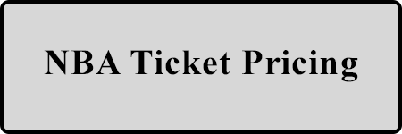

Hi, I’m Ryan O'Connell — a data scientist specializing in sports analytics and economics. My work bridges the worlds of data and decision-making, turning raw numbers into actionable insights for sports and business. Explore my projects below!

&nbsp; 

**Sports Game Data Analytics:**

The following projects focus on in-game performance, player evaluation, and scoring trends.
&nbsp; 

&nbsp; 

**Economic and Business Analytics in Sports:**

These projects explore the economic side of sports, including fan behavior and revenue optimization.
&nbsp; 
 &nbsp; 

